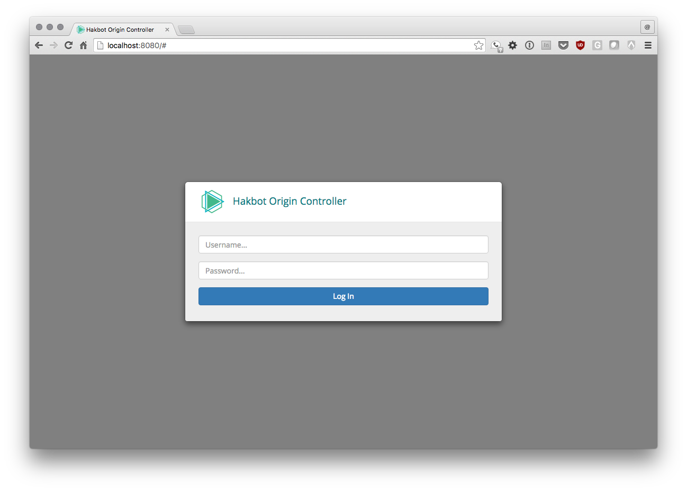
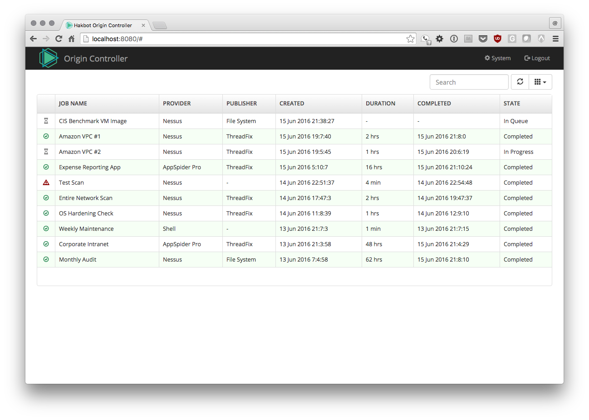
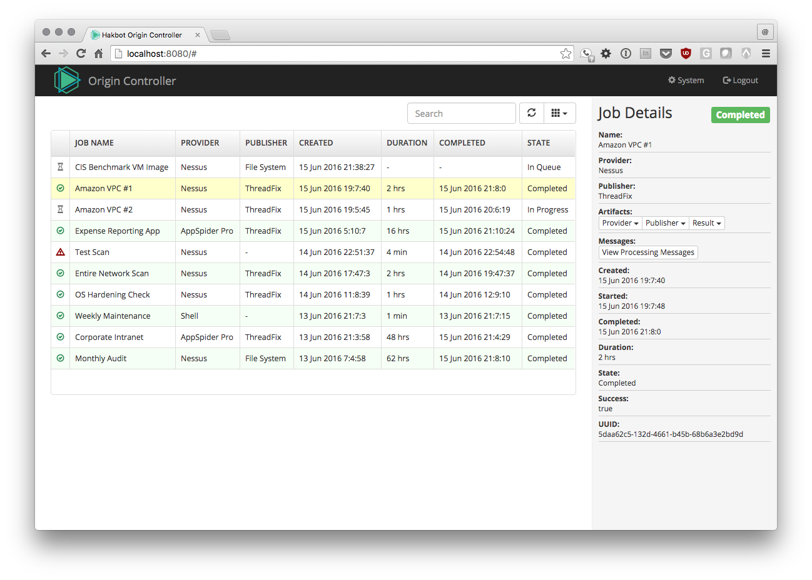
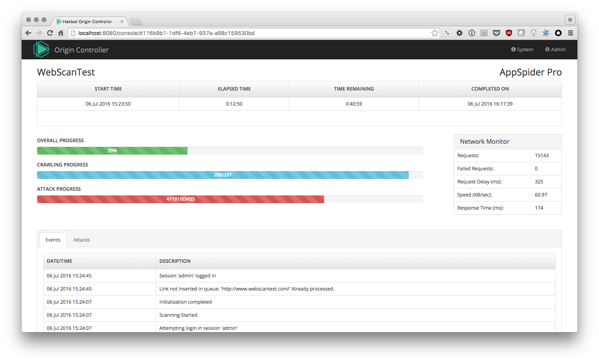
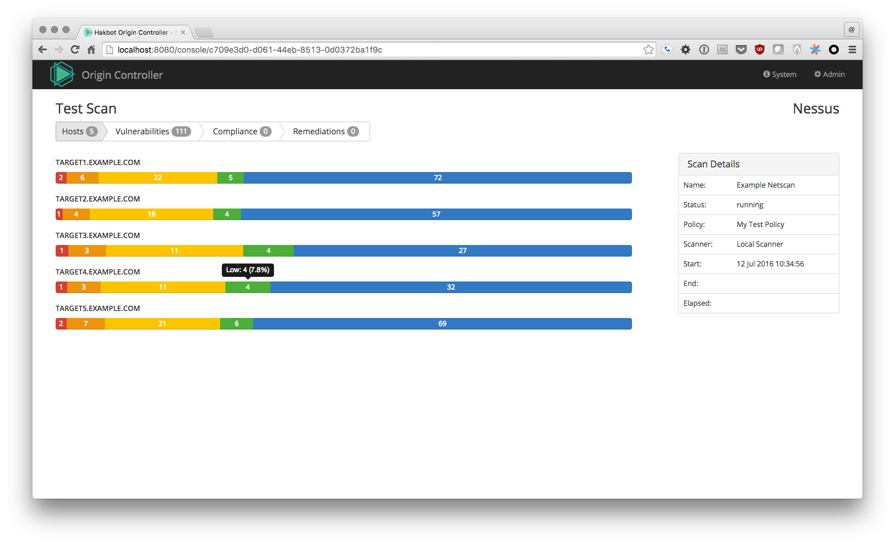
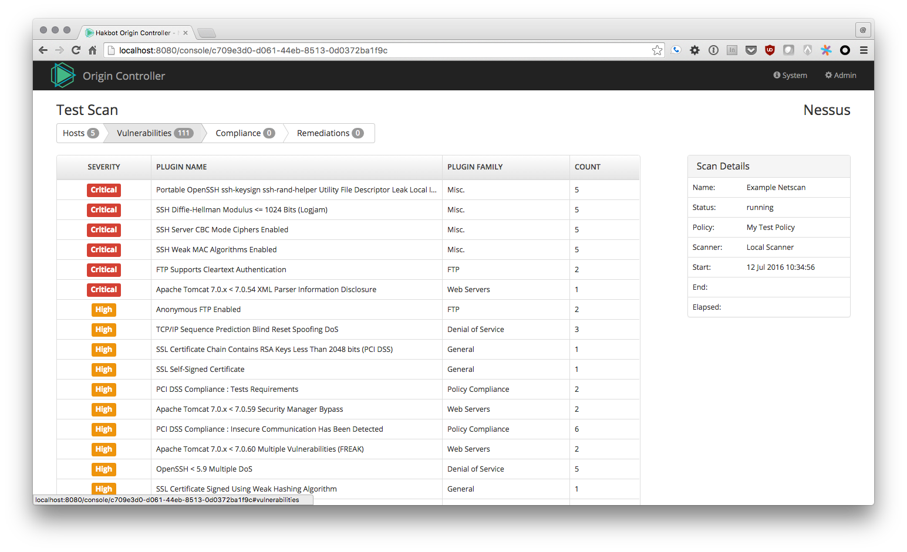

[](https://travis-ci.org/hakbot/hakbot-origin-controller) 
[](https://www.codacy.com/app/stevespringett/hakbot-origin-controller?utm_source=github.com&utm_medium=referral&utm_content=hakbot/hakbot-origin-controller&utm_campaign=badger)
[](https://github.com/stevespringett/Alpine)
[](https://gitter.im/hakbot/hakbot-origin-controller?utm_source=badge&utm_medium=badge&utm_campaign=pr-badge&utm_content=badge)

Hakbot Origin Controller
=====================================

A minimalistic job controller for use in Continuous Security and Continuous Delivery environments that provides a simple, standardized method for automating security tools. The result of which which can optionally be published to various security dashboards for increased visibility.

Background
-------------------

In software development, it is essential that security tools are integrated into every step of the
development process. Sometimes, custom tools and scripts may be necessary to integrate with continuous
integration servers, the security tools, and the target application being tested.

This is why the Hakbot Origin Controller came about. The controller accepts incoming jobs over JSON/HTTP,
places the jobs into a queue for processing, and when worker threads are available, the jobs will
be processed.

Jobs can be anything ranging from executing shell scripts to controlling dynamic analysis engines.

Hakbot Origin Controller is built on top of [Alpine].

Features
-------------------

* Configurable queue and job engine
* Sequential or simultaneous execution of jobs from the same provider
* Job console to monitor status of running jobs (optional/plugin specific)
* Configurable and enforceable authentication and authorization
* Team permission model for managing authorization of API keys and LDAP users
* API key support
* Active Directory support
* RESTful endpoints that respond with JSON
* Swagger2 support
* Embedded database engine (H2)
* Requires Java 8 or higher

Screenshots
-------------------








Providers
-------------------

Providers are the integration points that can be controlled through the Hakbot Origin Controller. Writing
a custom provider is straight-forward and simply involves extending the BaseProvider class.

Providers included are:

* Shell - Executes any shell command or script
* AppSpider - Performs AppSpider Pro (formally NTOSpider) dynamic analysis
* Nessus - Performs a Nessus scan against one or more targets

Publishers
-------------------

Publishers take the result generated by a provider, such as the result of a Nessus or AppSpider scan, and publishes
them in some way.

Publishers included are:

* FileSystem - Saves the results to the filesystem
* KennaSecurity - Upload the results to KennaSecurity
* ThreadFix - Upload the results to ThreadFix for vulnerability aggregation and normalization

Consoles
-------------------

A console is an optional feature of providers. A provider that also implements a console will benefit
from the ability to monitor the status of the job as it's executing and provide the end user a way to
view and/or interact with the running job.

Use Cases
-------------------

### Automating Dynamic Analysis
DAST engines like AppSpider Pro only allow one simultaneous scan to take place at any given time. In order to automate
dynamic analysis using AppSpider Pro, a queuing system must be used to stack the jobs in sequential order. Additionally,
multiple AppSpider Pro instances can be defined, each instance with it's own URL, username, and password. This is the
basis for the AppSpider Enterprise offering, but without the additional benefits of using AppSpider Enterprise. If
organizations simply want to automate one or more instances of AppSpider Pro, this project may be of benefit.


### Limiting Scan Fatigue
A scan, regardless of provider, may take a large amount of network bandwidth or consume host resources. When multiple
scans are being performed by different tools, it may be desirable to limit the fatigue caused by these tools to a
realistic level.


### Auto Publishing Results
If the provider that's executed contains results, those results can be automatically published. Like providers,
publishers perform a specific task; they take results from the provider and do something with them. Results could be
published to a spreadsheet, populated in a database, or pushed to ThreadFix for vulnerability aggregation.


### General Purpose Use
At it's core, Origin Controller is a simple pipeline job controller and can be used for a variety of tasks, not just
security-specific. Examples of pipelines that may benefit from this technology are export or conversion jobs such as
video encoding where a jobs provider may specify source video and encoding parameters and the jobs publisher may
publish to CDNs or asset management applications.


Distributions
-------------------

Ready-to-deploy distributions will be available beginning with 1.0.0-beta-1. Hakbot Origin Controller
supports the following two deployment options:

* Executable WAR
* Conventional WAR
* Docker container


Deploying the Executable WAR
-------------------

The easiest way to get Hakbot Origin Controller setup is to automatically create and deploy an executable WAR.

```shell
mvn clean package -P embedded-jetty
java -jar target/origin-controller-embedded.war
```


Deploying the Conventional WAR
-------------------

This is the most difficult to deploy option as it requires an already installed and configured Servlet 
container such as Apache Tomcat 8.5 and higher, however, it offers the most flexible deployment options.

```shell
mvn clean package
```
Follow the Servlet containers instructions for deploying `origin-controller.war`.

 
Deploying With Docker
-------------------

For users leveraging Docker, the process simply wraps the executable WAR inside a Docker container.
Begin by first compiling the software, then by executing Docker-specific commands. 

```shell
mvn clean package -P embedded-jetty
docker build -f src/main/docker/Dockerfile -t hakbot .
docker run -p 8080:8080 -t hakbot
```
 
 
Compiling
-------------------

To create an executable WAR that is ready to launch (recommended for most users):

```shell
mvn clean package -P embedded-jetty
```

To create a WAR that must be manually deployed to a modern Servlet container (i.e. Tomcat 8.5+):

```shell
mvn clean package
```


Configuration
-------------------

Configuration is performed by editing application.properties. Among the configuration parameters are:

* Job processing and optimization parameters
* Whitelisting (enabling) of specific providers and publishers
* Gzip compression support
* Independently enforce authentication and authorization
* Active Directory integration (via LDAP)
* Configuration of one or more instances of providers and publisher

Usage
-------------------

The URL for the API is: http://$HOSTNAME:$PORT/$CONTEXT/api

Swagger JSON is located: http://$HOSTNAME:$PORT/$CONTEXT/api/swagger.json

Data Directory
-------------------

Hakbot uses ~/.hakbot on UNIX/Linux systems and .hakbot in current users home directory on Windows machines.
Within this directory will be individual directories for each Hakbot component, including Origin Controller.
The origin-controller directory will contain log files, the embedded H2 database, as well as keys used during
normal operation, such as validating JWT tokens. It is essential that best practices are followed to secure the
.hakbot directory structure if jobs contain sensitive information.

Wiki
-------------------

Please consult the [wiki](https://github.com/hakbot/hakbot-origin-controller/wiki) for additional documentation and examples.

Copyright & License
-------------------

Hakbot Origin Controller is Copyright (c) Steve Springett. All Rights Reserved.

Permission to modify and redistribute is granted under the terms of the [GPL 3.0] license.

  [GPL 3.0]: http://www.gnu.org/licenses/gpl-3.0.txt
  [Alpine]: https://github.com/stevespringett/Alpine
